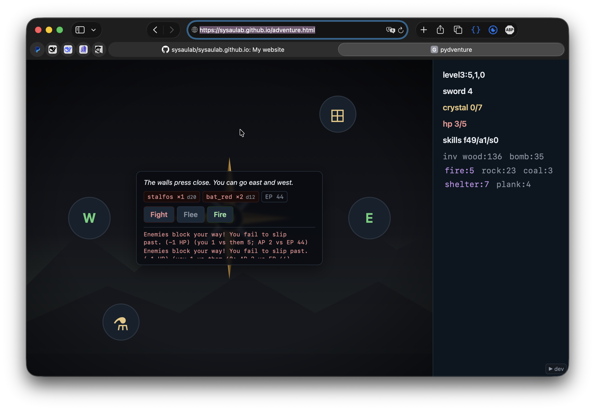
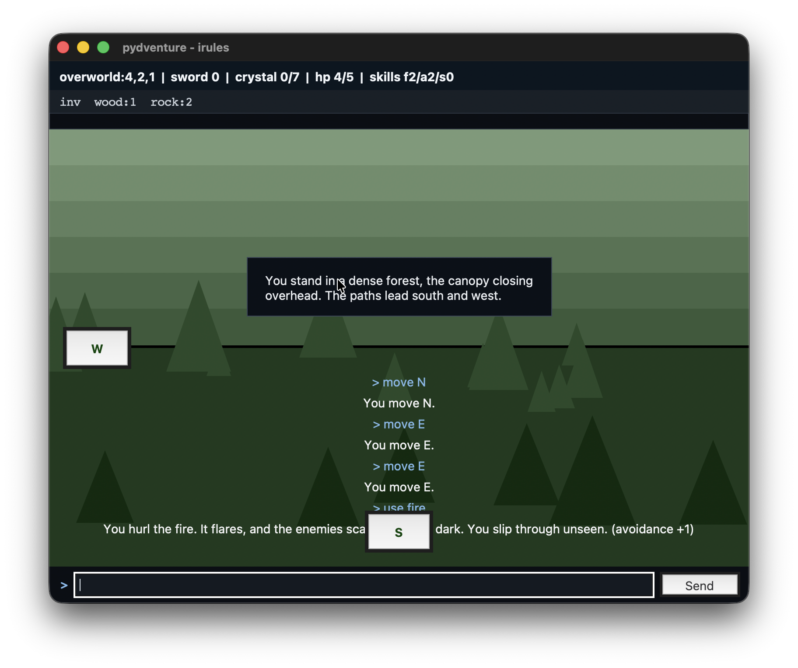
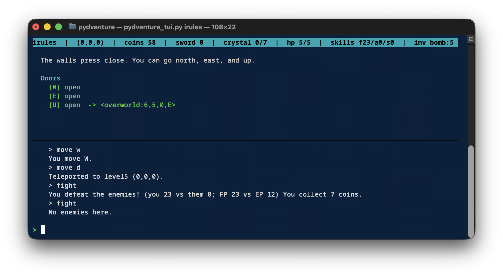
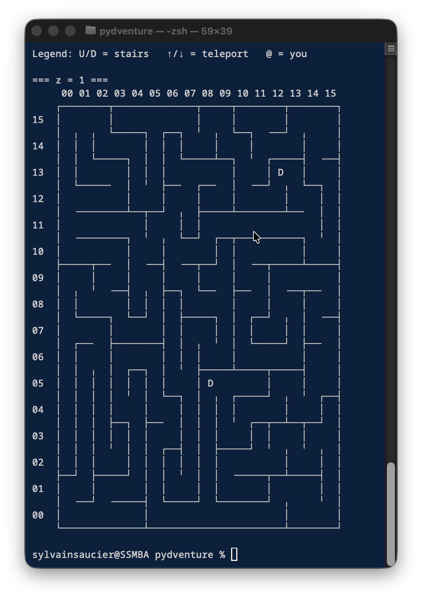

# pydventure

For the web port, click [here](https://sysaulab.github.io/adventure.html). For the python text based original, keep reading.

A small, hackable text-adventure engine. You explore a world of procedurally
generated rooms, craft tools from what you find, fight monsters with dice,
collect crystals, and descend into dungeons. Everything is stored as plain
files in a directory you can read, edit, copy, and cheat with.

Runs offline on Python 3. No dependencies.

---

## Philosophy

- **Human-readable.** Rooms are one-line text files. Tables are JSON. If you
  can read, you can mod.
- **Easy to cheat.** Open `player.state` in a text editor and give yourself
  ten thousand coins. Nobody's stopping you. That's the point.
- **Terminal-native.** No windows, no installers, no launcher. Type a
  command, read the result.
- **Small surface.** One room loaded at a time. The engine doesn't know the
  world exists — it knows which room you're standing in. A million rooms cost
  nothing until someone walks them.

---

## Requirements

- **Python 3.8+**. Windows: <https://www.python.org/downloads/> (check
  "Add Python to PATH" during install). macOS/Linux usually ship with it.
- **A terminal.** Windows: `cmd` or better, Windows Terminal. macOS:
  Terminal.app. Linux: whatever you've got.
- **Tkinter** (optional, for the GUI front ends). Bundled with most Python
  installs. If `python -c "import tkinter"` fails, install it via your
  package manager (`apt install python3-tk`, `brew install python-tk`, or
  re-run the Windows installer with the tcl/tk option checked).

If `python` isn't found, try `python3`.

---

## Screenshots









---

## Getting the files

Put all eight scripts in one folder, e.g. `pydventure/`:

```
pydventure.py             # engine + plain-text front end
pydventure_tui.py         # curses front end
pydventure_touch.py       # tkinter front end with terrain art + door compass
pydventure_gamemaker.py   # writes the JSON tables
pydventure_mazemaker.py   # carves mazes into rooms/
pydventure_map.py         # Unicode map renderer
pydventure_mapchecker.py  # reports dangling and one-way exits
```

`cd` into that folder in your terminal before running anything.

---

## Create a world

```
python pydventure_gamemaker.py mygame --seed 42
```

This creates `mygame/` next to the scripts, writes the game tables, then runs
the maze generator to fill `mygame/rooms/`. Change the seed for a different
world; reuse a seed to get it back.

Options:

| Flag            | Default | Meaning                                 |
|-----------------|---------|-----------------------------------------|
| `--seed`        | `0`     | Layout seed (any string or integer).    |
| `--width`       | `8`     | Overworld width.                        |
| `--height`      | `8`     | Overworld height.                       |
| `--depth`       | `2`     | Overworld floors (surface + caves).     |
| `--dungeons`    | `7`     | Number of dungeons.                     |
| `--force`       | off     | Overwrite existing tables.              |
| `--no-generate` | off     | Write tables, skip room generation.     |

A bigger world: `--width 24 --height 24 --dungeons 12`. There's no upper
limit except disk and your patience.

The default world has **seven dungeons**, each holding one crystal. The
eighth "level" is a shrine where you win the game.

---

## Play

Plain mode (works anywhere):

```
python pydventure.py mygame
```

TUI mode (nicer — status bar, room pane, scrolling log):

```
python pydventure.py mygame --tui
```

TUI uses `curses`. On Windows, use Windows Terminal; older `cmd.exe` may
fail and the game will fall back to plain mode automatically. Pass
`--no-tui` to force plain mode even if `--tui` is in your shell history.

Windowed mode (tkinter):

```
python pydventure_gui.py mygame
```

Touch / decorated mode (tkinter with procedural terrain art drawn behind the
room, and doors laid out as a compass rose):

```
python pydventure_touch.py mygame
```

All four front ends drive the same `GameSession`. Save files are shared: you
can play a turn in the GUI, quit, and pick it up in the TUI on the same
directory.

---

## Commands

Case doesn't matter. Abbreviate items freely.

| Command                             | Effect                                              |
|-------------------------------------|-----------------------------------------------------|
| `move n` (or just `n`)              | Move. Directions: `n e s w u d`.                    |
| `retreat`                           | Step back through the door you just came through.   |
| `fight`                             | Attack. Rolls against your Fight pool.              |
| `flee` or `avoid`                   | Try to slip past. Rolls against Avoidance.          |
| `use fire`                          | Burn out the room. See "Fire" below.                |
| `use shelter`                       | Rest. Restores full HP, consumes one shelter.       |
| `use <heart>`                       | Consume a heart: +1 max HP and heal 1.              |
| `use search`                        | Search for hidden doors and items.                  |
| `use search <dir>`                  | Search a specific door.                             |
| `use <item> [dir]`                  | Use an item on a door.                              |
| `combine <a> <b> [...]` (or `craft`, `make`) | Craft. Consume inputs, get an output.      |
| `take <item>`                       | Pick something up. If it's for sale, says so.       |
| `buy <item>`                        | Buy from a shop.                                    |
| `enter <n>`                         | Enter zone N of a multi-zone room.                  |
| `save` / `quit`                     | Save. `quit` also exits.                            |
| `reset`                             | Wipe your save. Erases player.state and all `.state` files. |

Any command that isn't a fight, flee, heal, or fire will first attempt an
auto-avoid roll if enemies are present. If it fails, you eat damage and the
action doesn't happen. So don't try to walk past a dragon without a plan.

---

## Combat, HP, and death

Fights are **random**. Your Fight pool is:

```
1 + fight_skill + 20 * sword_level
```

The enemies roll their own pool (their difficulty rating, summed and
multiplied by count). Highest roll wins; ties go to you. Same math for
Avoidance, except its pool is just `1 + avoidance_skill`.

- **Win a fight** → +1 Fight skill, plus whatever the enemy drops (wood,
  rock, coal, bombs, ore, and — from dragons — a heart).
- **Lose a fight** → you take `damage_per_fail` HP damage. You can retry.
- **Win a slip-past** → +1 Avoidance skill, no damage, no drops.
- **Fail a slip-past** → same HP cost as a failed fight.

You start with **5 HP**. Every `heart` you `use` raises your maximum by 1
and heals 1 point. Dragons always drop a heart. A `shelter` restores you to
full HP and is consumed.

When HP reaches zero, you don't die — you **collapse**, and wake up at the
entrance of the map you were in (the overworld start room, or the dungeon
entrance), full HP, minus half your coins. Items, skills, sword level, and
crystals are kept.

That's the whole death penalty: **walk back plus a coin sting.** Not a wipe.

---

## Fire

Fire is the escape hatch. `use fire` scatters every enemy in the current
zone — no roll, no damage, no drops — and grants **+1 Avoidance skill**.
One fire is consumed per use.

Use it when you're outmatched, when you want to reach a crystal chamber
without fighting the boss, or when you need a guaranteed +1 avoidance and
have wood to spare.

The trade-offs:

| | `fight` | `flee` | `use fire` |
|---|---|---|---|
| Roll required | yes | yes | no |
| HP risk on fail | yes | yes | no |
| Skill gained | +1 fight | +1 avoidance | +1 avoidance |
| Drops loot | yes | no | no |
| Consumes an item | no | no | yes (fire) |

Fire is craftable: two wood.

---

## Crafting

Combine items to make better ones. The `combine` command takes any number of
inputs and matches them against the recipe table — order doesn't matter.

```
> combine rock rock
You combine rock + rock into blunt_knife.
> combine blunt_knife wood
You combine blunt_knife + wood into plank.
```

Recipe table (`recipes.json`):

| Inputs                  | Output         |
|-------------------------|----------------|
| wood × 2                | fire           |
| rock × 2                | blunt_knife    |
| blunt_knife + wood      | plank          |
| plank × 2               | shelter        |
| fire + wood             | coal           |
| coal + ore              | steel          |
| blunt_knife + steel     | sword          |

The `sword` you get from combining is not the same as the `sword` item that
raises `sword_level` — it stacks into inventory until you spend it on a
recipe... actually, it *is* the same item name, so `take sword` from a
pedestal raises `sword_level` directly, while a crafted sword sits in your
inventory as an item. Check your recipes if you want to know which is which
in your world. (Yes, this is a known naming wart. It's on the list.)

The recipe list is disallowed from having duplicate input signatures. If you
add one, the engine refuses to start.

---

## The goal

Each of the seven dungeons holds a **crystal** guarded by a dragon. Take
all seven to the shrine (`level8`) and place them on the altar to win.

The shrine door requires `crystal-7` — a consumable requirement that eats
all seven crystals on entry. Beyond it is a red dragon, and behind him the
`victory` item. Taking it prints the victory message and ends the game.

After you win, `player.state` keeps `"won": true`. Loading a won save
prints "The world is quiet. You have already won." in plain mode. You can
keep exploring.

Crystals are quest items and never drop from kills — every crystal you need
exists somewhere in a dungeon, waiting.

---

## Enemies come back

Rooms you've cleared stay cleared — for a while. Every time the engine
loads a `.state` file it checks the file's modified time. If it's older
than `respawn.minutes` and a `respawn.chance` dice roll hits, the room
repopulates from its original enemy list. Items you've taken, doors you've
unlocked, and bosses do **not** respawn.

Defaults: 5 minutes, 20% chance. So cleared rooms are usually still empty
when you walk back — but lingering in one place has a cost.

Boss enemies (`dragon`, `dragon_red`) never come back. That list lives in
`maps.json` under `respawn.no_respawn`.

The generator places a **bomb wall** in most dungeons: a door marked
`N[bomb]` on both sides, invisible until you find it, that only opens when
you spend a bomb. Once opened from either side, both sides stay open. Bomb
walls are the reason dungeons have dead ends that look suspicious.

---

## Hacking the world

**Everything is editable.** The engine reads tables on startup and rooms on
demand. Change a file, play again.

### Cheat immediately

`mygame/player.state` is plain JSON:

```json
{
  "map": "overworld", "x": 0, "y": 0, "z": 1, "zone": 0,
  "coins": 0,
  "inventory": {},
  "skills": {"fight": 0, "avoidance": 0, "search": 0},
  "sword_level": 0, "won": false,
  "hp": 5, "max_hp": 5
}
```

Edit and reload. `"coins": 999999`. `"sword_level": 10`.
`"inventory": {"crystal": 7, "heart": 20}`. It just works.

### Edit a room

Rooms are one line of flow, then an optional description:

```
NESW{bat_blue} (crystal)
A narrow stone hall, water dripping somewhere.
```

Change the enemies, add items, delete a door. Save. Re-enter the room. The
engine reads whatever's there.

### Edit the tables

| File              | Controls                                              |
|-------------------|-------------------------------------------------------|
| `enemies.json`    | Enemy difficulty and description.                     |
| `drops.json`      | Per-enemy loot ranges (wood, rock, coal, ore, bombs, hearts). |
| `items.json`      | Item names, types, descriptions.                      |
| `skills.json`     | The three skills.                                     |
| `recipes.json`    | Crafting: `{"recipes": [{"inputs": {...}, "output": {...}}, ...]}`. |
| `world.json`      | Maps, terrains, features, description templates.      |
| `maps.json`       | Start map, goal, respawn policy, combat tuning.       |

### Tuning knobs in `maps.json`

```json
"combat": {
  "damage_per_fail": 1,
  "heart_item": "heart",
  "shelter_item": "shelter",
  "fire_item": "fire",
  "death": {
    "coin_loss_fraction": 0.5,
    "restore_hp": true
  }
},
"respawn": {
  "minutes": 5,
  "chance": 0.2,
  "no_respawn": ["dragon", "dragon_red"]
}
```

- `damage_per_fail: 2` — twice the pain.
- `coin_loss_fraction: 0` — forgiving mode.
- `respawn.chance: 0` — cleared rooms stay cleared forever.
- `respawn.minutes: 60` — the world barely breathes.
- `fire_item: "torch"` — rename the item the fire branch looks for. The
  `use fire` path reads this key; if you rename the item in `items.json`
  but not here, `use fire` still looks for `fire`.

No defaults in the engine. Delete a key and it crashes on startup. That's
intentional.

### The room DSL

Full syntax, if you want to write rooms by hand:

| Snippet               | Meaning                                          |
|-----------------------|--------------------------------------------------|
| `N`                   | Open door north.                                 |
| `N[search]`           | Hidden door — invisible until `use search`.      |
| `N[bomb]`             | Door requires a bomb item.                       |
| `N[bomb-1]`           | Door requires a bomb and consumes it on use.     |
| `N[key-3]`            | Door requires three keys (consumes them).        |
| `N[fight]`            | Door requires Fight skill > 0.                   |
| `N<cave:2,1,0,N>`     | Door teleports to cave (2,1,0) entering from N.  |
| `U` / `D`             | Stairs up / down.                                |
| `U<map:1,2,0,S>`      | Teleport up to another map.                      |
| `{bat_blue,bat_red+1}`| Enemies: one blue bat, two red bats.             |
| `(sword,key@100)`     | Items: a sword, and a key for sale at 100 coins. |
| `(crystal[search])`   | Crystal hidden until searched.                   |
| `N,(items...)`        | Comma splits a room into multiple zones.         |
| `[search]N`           | Zone-entry requirement (consumed on entry).      |

The generator emits only the simple forms. Everything else is yours.

### Regenerating rooms from an edited `world.json`

```
python pydventure_mazemaker.py --config mygame/world.json --out mygame/rooms
```

Add `--keep-existing` to preserve rooms you've already saved state in.

### Renaming the fire item

The `use fire` shortcut looks up `combat.fire_item` in `maps.json`. To
rename fire to `torch` in a game, edit both `items.json` (the item entry)
and `maps.json` (the `fire_item` key), then update any recipes in
`recipes.json` that reference `fire`. If you only edit one of the three,
`use fire` stops working — or starts working on the wrong item.

---

## Tools

**Check a map for broken exits:**

```
python pydventure_mapchecker.py mygame/rooms/overworld
```

Lists every room, its exits, dangling exits (leading off the map), and
one-way doors (where a door has no matching return).

**Draw a floor as Unicode art:**

```
python pydventure_map.py mygame/rooms/overworld
python pydventure_map.py mygame/rooms/overworld --all
python pydventure_map.py mygame/rooms/overworld -z 1 --player 0 0
python pydventure_map.py mygame/rooms/overworld --ascii
python pydventure_map.py mygame/rooms/overworld --all --watch
```

`--watch` redraws whenever a `.room` file changes. Nice for editing by hand.

---

## File reference

| File                       | Role                                                     |
|----------------------------|----------------------------------------------------------|
| `pydventure.py`            | Engine, parser, session, plain front end.                |
| `pydventure_tui.py`        | Curses front end. Reuses `GameSession` unchanged.        |
| `pydventure_gui.py`        | Tkinter front end: status, inventory, room pane, log.    |
| `pydventure_touch.py`      | Tkinter front end with terrain art and a door compass.   |
| `pydventure_gamemaker.py`  | Writes JSON tables, invokes the mazemaker.               |
| `pydventure_mazemaker.py`  | Carves mazes, places features, writes `.room` files.     |
| `pydventure_map.py`        | Map renderer, importable as a module.                    |
| `pydventure_mapchecker.py` | Room reporter for debugging.                             |

Inside a game folder:

```
mygame/
├── enemies.json
├── drops.json
├── items.json
├── skills.json
├── recipes.json
├── world.json
├── maps.json
├── player.json               # initial player (template)
├── player.state              # your save (created on first save)
└── rooms/
    ├── overworld/
    │   ├── 0_0_1.room        # pristine room
    │   ├── 0_0_1.state       # your modified version (created on first visit)
    │   └── ...
    ├── level1/
    ├── ...
    └── level8/
```

`.room` files are the generated originals. `.state` files are what the world
looks like after you've been there — looted, cleared, doors unlocked. Delete
a `.state` file and that room reverts.

---

## Troubleshooting

**`python: command not found`** — try `python3`. On Windows, reopen your
terminal after installing Python.

**`enemies.json missing`** — you skipped `pydventure_gamemaker.py`.

**`KeyError: 'combat'` or `'respawn'`** — you have an old `maps.json`.
Regenerate with `--force`.

**`KeyError: 'fire_item'`** — same cause, same fix. `fire_item` is a newer
key; older saves need a regenerated `maps.json`.

**`combine rock rock` does nothing** — check `recipes.json`. Duplicate
signatures are rejected at load, and unknown inputs report "You don't know
how to combine…".

**TUI looks like garbage** — your terminal doesn't support curses. Drop
`--tui`.

**GUI window opens then closes** — tkinter isn't installed. See Requirements.

**"There is no door in that direction"** — maybe there really isn't. Maybe
it's hidden. Try `use search`.

**"Enemies too strong" / stuck in a room** — you can always retry `fight` or
`flee`. Rolls are fresh every time. If HP is low, `retreat` back the way you
came and heal. If you have a fire in inventory, `use fire` is a guaranteed
out.

**Start room has enemies** — that's the game being mean on purpose. Edit
`mygame/rooms/overworld/0_0_1.room` and delete the `{...}` block.

**"You need 7 crystal."** at the shrine door — you don't have all seven.
Check `player.state` for a shortcut, or keep exploring.

---

## A short session

```
python pydventure_gamemaker.py mygame --seed 42
python pydventure.py mygame
```

At the `>` prompt:

```
> move n
> move e
> use search
> fight
> combine wood wood
> use fire
> take sword
> move s
> move d
> fight
> flee
> retreat
> save
> quit
```

Have fun. Watch out for the dragon.

---

## What's next

The engine is deliberately small. Some things that exist in the code but
aren't exercised by the default world:

- **Shops.** The `buy` command and `price` field work, but the default
  `world.json` doesn't place any shops. Add one under
  `maps[0].features.shops` to bring commerce back.
- **Coins.** Nothing currently drops or requires coins in the default
  world. The plumbing is there if you want a shop-centric game.
- **Multi-zone rooms.** The DSL supports them via commas; the generator
  doesn't emit them yet.
- **The `shield` and `candle_blue` items.** They exist in `items.json` but
  nothing crafts, drops, or consumes them. Free items if you want them.

The Python source is one file per role, no framework, no build step. If
something here is wrong, or missing, or in your way — open it, change it,
reload.